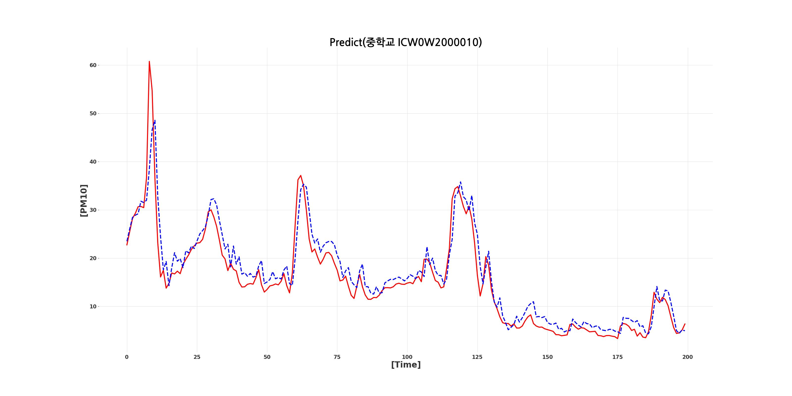
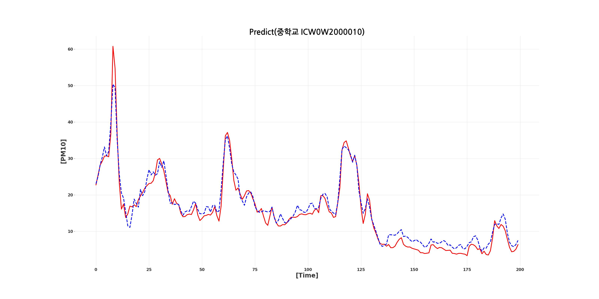

# **최종 파이프라인의 예시 코드는  <a href='metats/pipeline 성능 측정 예시.ipynb'>여기</a>에서 볼 수 있습니다.

# [제안하는 목표 시스템의 구조도]

## [딥러닝 모델1 - LSTM]

## [딥러닝 모델2 - Attention-LSTM]

## [딥러닝 모델3 - Dual-Attention-LSTM]

## [STL 적용 전 결과(예시)]

## [STL 적용 후 결과(예시)]

