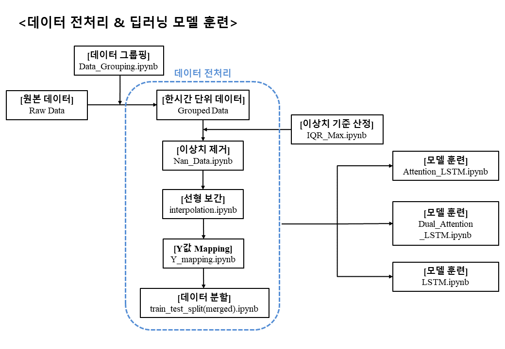
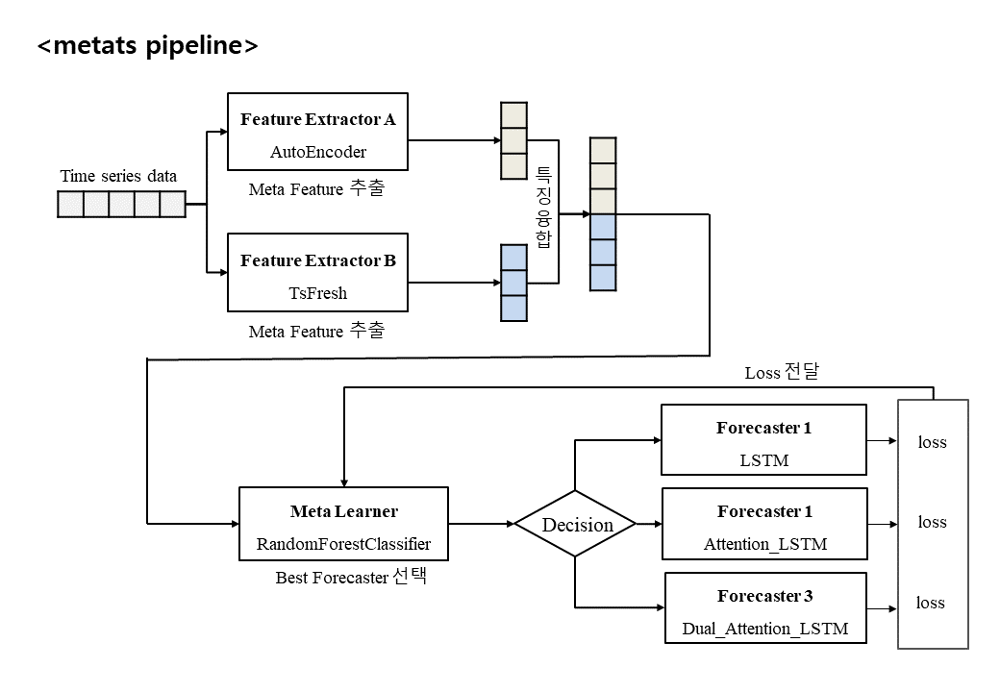

# 📁[Data Preprocessing]
* **Data_Grouping.ipynb** : 기존의 1분 단위의 데이터를 1시간 단위로 그룹핑하는 코드
* **Date_Check.ipynb** : 시설 유형별 길이가 가장 긴 데이터 샘플을 확인하는 코드
* **interpolation.ipynb** : 결측치와 이상치 값에 대하여 Linear Interpolation을 적용하는 코드
* **IQR_Max.ipynb** : 각 항목의 이상치 기준을 산정하고자 시설별 샘플의 사분위값 범위를 계산하는 코드
* **Len_Merge.ipynb** : 시설 유형별 길이가 가장 긴 데이터 샘플을 병합하고 Scaler를 훈련하는 코드
* **Nan_Data.ipynb** : 도출한 이상치 범위에 해당하는 값과 누락된 시간 행을 None(결측치)로 처리하는 코드
* **train_test_split(merged).ipynb** : 병합한 데이터 샘플을 8:1:1(train:valid:test)의 비율로 나누는 코드
* **Y_mapping.ipynb** : 한시간 후의 PM10 수치를 Y값으로 Mapping하는 코드

# 📁[Grouped_Data]
* 한시간 단위로 그룹핑한 데이터샘플을 저장한 폴더

# 📁[IQR]
* 사분위값 범위를 시각화하여 이미지로 저장한 폴더

# 📁[Merged_Data]
* 시설 유형별 길이가 가장 긴 데이터 샘플을 병합하여 저장한 폴더

# 📁[Model_Training]
#### 📁[Saved_Model] : Attention_LSTM, CNN-LSTM, Dual_Attention_LSTM, LSTM 모델을 훈련하여 저장한 폴더
* **Attention_LSTM.ipynb** : Attention_LSTM모델을 window size = 24, epoch = 100으로 훈련한 코드
* **CNN_LSTM.ipynb** : CNN_LSTM모델을 window size = 24, epoch = 100으로 훈련한 코드
* **Dual_Attention_LSTM.ipynb** : Dual_Attention_LSTM모델을 window size = 24, epoch = 100으로 훈련한 코드
* **LSTM.ipynb** : LSTM모델을 window size = 24, epoch = 100으로 훈련한 코드

# 📁[RawData]
* 원본 데이터가 저장된 폴더 

# 📁[metats]
#### 📁[metats] : 파이프라인 구축에 필요한 함수가 저장된 폴더
* **pipeline.ipynb** : metats 파이프라인을 구축하는 코드

